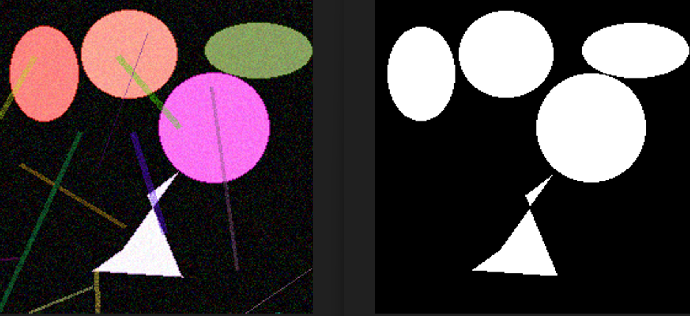
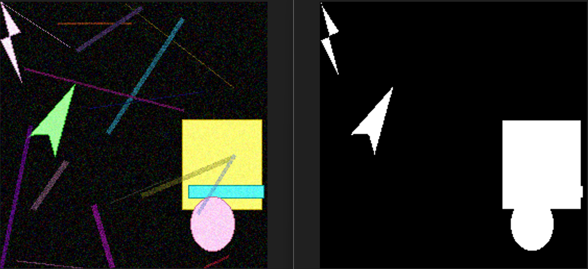
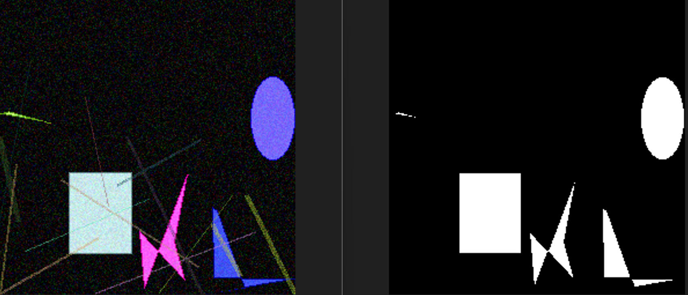
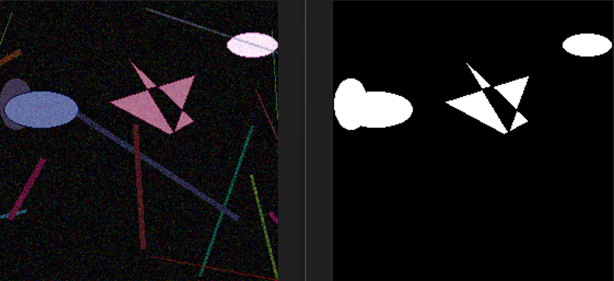

# 📡 HotSpot 📡

## Enunț

În anul 2147, omenirea a renunțat la fire. Totul e wireless. În orașele-ruină ale unei societăți distopice
<span style="color: green;">as zice "societăți utopice” (ca sa-i dam o perspectivă optimistă și pozitivă, nu una negativă)</span>
, semnalul WiFi este sursa principală de energie, comunicare și control. Din cauza suprasaturării cu rețele și emițătoare, undele radio sunt instabile, interferențele sunt la ordinea zilei, iar zonele cu semnal clar 
<span style="color: green;"> și curat</span> - așa-numitele `HotSpots` - sunt rare și extrem de valoroase.

O agenție secretă, `Umbrella Corporation`, a dezvoltat un sistem 
<span style="color: green;"> inteligent </span>
de analiză vizuală pentru a cartografia aceste HotSpots folosind imagini satelitare modificate. Aceste imagini prezintă diferite forme geometrice 
(cercuri, elipse, dreptunghiuri și poligoane) 
<span style="color: green;"> oare poligon nu e prea permisiv? eu aș zice așa ”În aceste imagini apar diferite forme geometrice 2D (cercuri, elipse, dreptunghiuri sau triunghiuri) </span>
care reprezintă  așa zisele HotSpots. Însă, acest sistem nu este perfect, iar imaginea este afectată de `zgomot de fundal aleatoriu` și `benzi (stripes) semi-transparente` care simulează  interferențele radio.
<span style="color: green;">Eu aș zice așa: Însă acest sistem nu funcționează încă perfect pentru că unele imagini sunt afectate de `zgomot de fundal aleatoriu` (*random noise*) și `benzi semi-transparente` (*stripes*) care simulează interferențele radio. </span>

**Misiunea ta este vitală**: la fel ca  în vechile operațiuni din `Orașul Ratonilor`, ai fost activat pentru a identifica acele rare zone cu semnal curat - **HotSpots**. Semnalul e viață. Restul e interferență.

## Date de intrare


Arhiva `Satellite_Images-1` conține **n** imagini, care au dimensiunea de 256x256, conținând 3 canale - RGB, numerotate `image_00000.png`, până  la `image_n.png` . 

Arhiva `Satellite_Images-2` conține *m** imagini, care au dimensiunea de 256x256, conținând 3 canale - RGB, numerotate `image_00000.png`, până  la `image_m.png` .
<!-- am inlocuit cu n si m pt ca sunt cunoscuteș x si y ma duce cu gandul la necunoscute si la in and out si nu e cazul sa dam de gandit -->

Imaginile reprezintă  harta semnalelor din diferite puncte strategice ale țării.


## Cerințe


**Cerința 1 (20p)** - Utilizând imaginile din arhiva `Satellite_Images-1`, determinați HotSpots pentru fiecare imagine din acea arhivă. 

**Cerința 2 (80p)** - Utilizând imaginile din arhiva `Satellite_Images-2`, determinați HotSpots pentru fiecare imagine din acea arhivă.

## Formatul de ieșire

Formatul de ieșire  constă  într-un fișier `output.csv`, care va include  următoarele 3 coloane:
- `subtaskID` - reprezintă numărul cerinței (1 sau 2)
- `datapointID` - care se referă  la denumirea fiecărei imagini din arhiva `Satellite_Images-subtaskID`.
- `answer` - care reprezintă **masca  binară a HotSpots-urilor** din imaginea respectivă, unde valoarea `1` este asociată unui pixel care aparține unui HotSpot, iar valoarea `0` este asociată celorlalte zone. Codificarea măștii  va fi făcută  utilizând  tehnica **Run-Length Encoding (RLE)** (vezi mai jos) .

<details>
    <summary> Run-Length Encoding (RLE) </summary>

### Run-Length Encoding (RLE)

RLE este o metodă de **compresie** pentru măști binare. În loc să se memoreze toți pixelii (0 sau 1) ai matricii suport, se memorează doar **pozițiile** unde încep secvențele de 1 și **lungimile** lor.

**Reguli pentru codificare**:
1.  Masca se parcurge **coloană cu coloană** (ordinea Fortran/column-major).
    
2.   Se indexează de la **1** (nu de la 0).
    
2.  Se codifică sub forma:  
    `start_1 length_1 start_2 length_2 ...`

**Exemplu**:
Fiecare element este un pixel (`1` = aparține unui HotSopt, `0` = fundal). Pentru o mască binară 2D:
```
0 0 1 0
0 1 1 0
0 0 1 0
0 0 1 0
0 0 0 0
```
<span style="color: green;"> eu aș da ca exemplu o matrice care sa codeze masca pt un patrat sau dreptunghi care nu e lipit de margini (sa fie rama de 0 in jurul lui) </span>

care, în format coloană (flattened column-major) devine: 
<span style="color: green;">ar fi bine să se folosească aceleași cuvinte pt noțiunea de parcurgere a matricii/imaginii ca sa nu-i bruiem cu exprimari diferite pt acelasi lucru: eu aș zice: ordinea *colomn-major* cu începere din colțul stânga sus al matricii (atât aici, cât și la regula1 de mai sus)</span>
`[0, 0, 0, 0, 0,   0, 1, 0, 0, 0,   1, 1, 1, 1, 0,   0, 0, 0, 0, 0]`

**Codificare RLE**
- `7 1` -> secvența de `1` începe de la index 7, având lungimea 1.
- `11 4` -> secvența de `1` începe de la index 11, având lungimea 4.

**RLE Final**:

`7 1 11 4`

</details>

## Evaluare

Evaluarea se va face folosind **F1-score la nivel de pixel**, comparând masca prezisă cu masca reală. Decodificarea se face automat din RLE în mască binară pentru fiecare imagine.

Trimiteți un singur csv care să conțină răspunsurile toate cerințele pe care le-ați rezolvat. Pentru a vedea un exemplu, descărcați fișierul `sample_output.csv`.

## Exemple de Ground Truth
<span style="color: green;"> eu aș evita folosirea termenului ”ground-truth” pt ca el ma duce cu gandul la supervised learningș as zice ”Exemple de măști”</span>

În  următoarele imagini vor fi prezentate (în  stânga) un exemplu de imagini din arhivă, iar în  dreapta  va fi prezentat Ground-Truthul asociat imaginii
<span style="color: green;"> masca binară asociată imaginii</span>
. Aceste exemple au rolul de a ajuta concurentul în a face diferență între ce se consideră `zgomot de fundal aletoriu (random noise)`, `artefacte din imagine (image artefacts)`, `benzi semi-transparente`, și ce se consideră a fi `HotSpot`. 

Notă: `HotSpots` pot să fie doar de tip cerc, elipsă, dreptungi și polygon (convex sau concav).
<span style="color: green;"> eu nu as pastra aceasta nota pt ca precizarea cu formele geometrice apare in enunt. Daca totusi se doreste sa intarim ca doar astfel de forme pot sa apara, atunci e bine sa fie referite la fel, inclusiv atributele de convexitate. </span>









